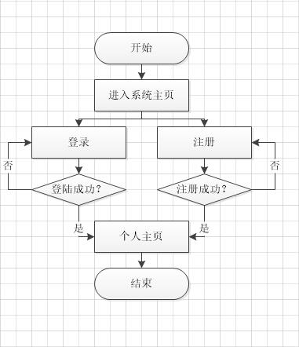
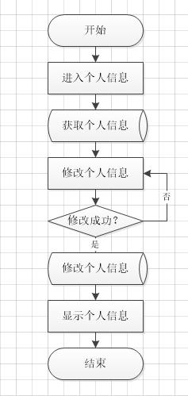
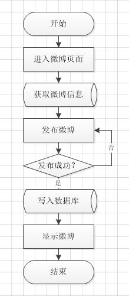
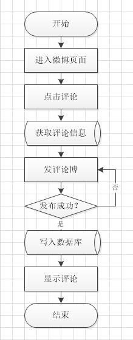

# 微博系统文档

## 小组

### 成员

李鸿正， 张仲鸣， 谢磊

#### 成员分工

* 李鸿正：负责系统的后台部分、数据库设计、服务器搭建
* 张仲鸣：负责前端 登录、注册、个人信息
* 谢磊：负责前端 微博系统、评论系统

### 所用技术

#### 后台

SpringMVC + Hibernate + PostgreSQL

* 服务器： 腾讯云
* 服务器系统：CentOS 7.3 64位
* CPU：1 核
* 内存：1 GB
* 公网带宽:1 Mbps
* 服务器地址：154.8.143.45

服务端： Tomcat8.0 + PostgreSQL9.4

#### 前端

Angular + Css + Bootstrap

## 项目实现功能

实现系统的登录、注册功能，个人信息管理，微博发布管理，评论发布管理

### 项目功能图

#### 登录/注册

#### 个人信息

#### 微博管理

#### 评论管理

### 数据库

#### users

column          | type |  default|null    | key
-   | :-:      | :-:      | :-:      | -:       |
user_id | varchar(255)      |  |not null|primary key
user_phone | varchar(255)     |  |not null|
user_email | varchar(255)     |  |not null|
user_password | varchar(255)     |not null|
user_nikename | varchar(255)     | |
user_time | TimeStamp     |||
user_status | int4     | default:0 |not null|

#### userinfo

column          | type |  default|null    | key
-   | :-:      | :-:      | :-:      | -:       |
userinfo_id | serial      |  |not null|primary key
userinfo_name | varchar(255)     |  ||
userinfo_gender | varchar(255)     |  ||
userinfo_address | varchar(255)     |||
userinfo_birth | Date     | |
userinfo_qq | varchar(255)    |||
userinfo_profs | varchar(255)     |  ||
userinfo_flag | varchar(255)     |  ||
user_id | int4     | |not null|foreign key

#### messages

column          | type |  default|null    | key
-   | :-:      | :-:      | :-:      | -:       |
messages_id | serial      |  |not null|primary key
messages_type | varchar(255)     |  ||
messages_info | varchar(255)     |  ||
messages_time | TimeStamp     |||
messages_commentnum | int4     |default:0 |
messages_agreement |    int4  |default:0||
messages_collection | int4     | default:0 ||
messages_label | varchar(255)     |  ||
user_id | varchar(255)     |  |not null|foreign key

#### comments

column          | type |  default|null    | key
-   | :-:      | :-:      | :-:      | -:       |
comments_id | serial       |  |not null|primary key
comments_info | varchar(255)     |  ||
comments_time | varchar(255)     |  ||
messages_id | varchar(255)     ||not null|foreign key
user_id | varchar(255)     || not null|foreign key
